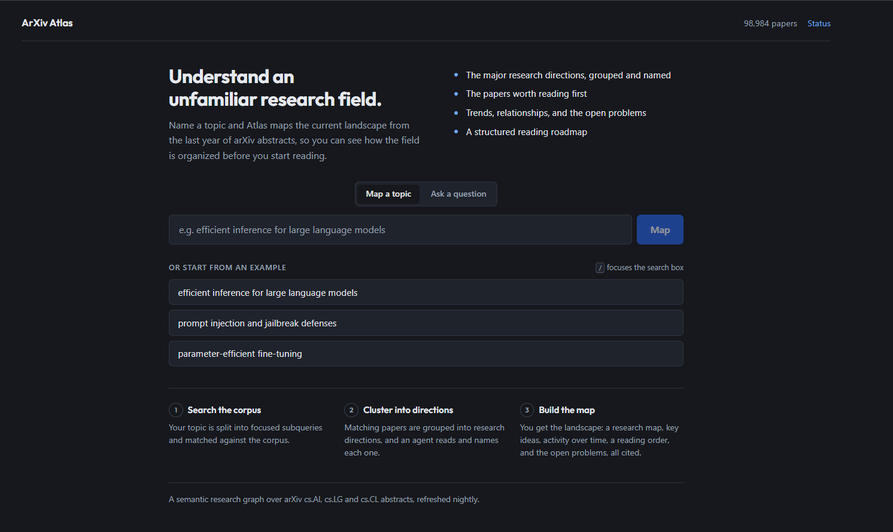
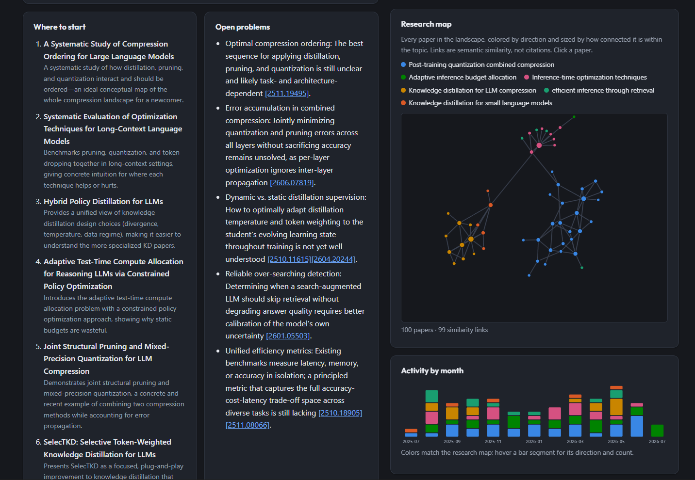
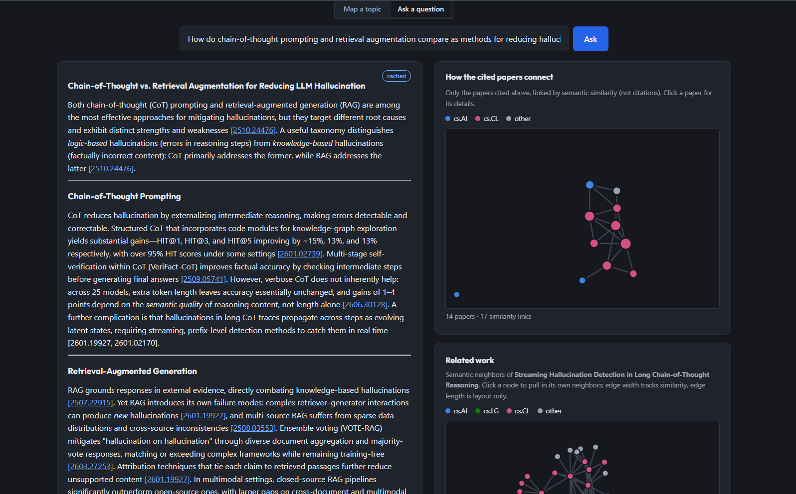
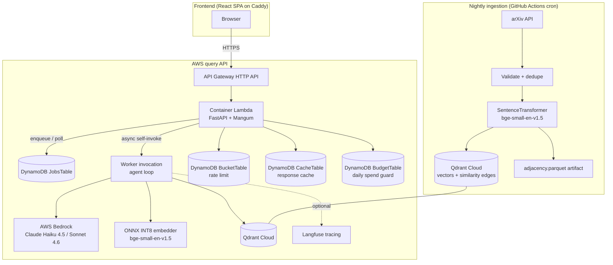

# ArXiv Atlas

[](https://github.com/IamTusharYadav/arxiv-atlas/actions/workflows/ci.yml)
[](https://github.com/IamTusharYadav/arxiv-atlas/actions/workflows/deploy.yml)
[](LICENSE)
[](.python-version)
[](frontend/package.json)
[](https://github.com/IamTusharYadav/arxiv-atlas/issues)

*A living map of AI research, drawn nightly by agents.*

**ArXiv Atlas** turns recent arXiv AI research into something you can explore. Every night an
ingestion pipeline pulls new papers from arXiv (`cs.AI`, `cs.LG`, `cs.CL`), embeds them locally,
and links them into a semantic similarity graph in a vector database. On top of that graph, a
framework-free agent loop running on AWS Bedrock powers two workflows:

- **Map a topic** into a structured landscape: the major research directions, the papers worth
  reading first, activity over time, and the open problems.
- **Ask a question** and get a synthesized brief in which every claim cites its paper, with the
  full agent trace attached.

It is built for researchers, engineers, and students who need to get their bearings in an
unfamiliar area fast, and as a worked example of operating an LLM system in production: a golden
evaluation set gates changes, a fail-closed budget guard caps daily spend, and a public status
page reports corpus size and live health.

- **Live site:** <https://atlas.tusharyadav.dev>

---

## Table of contents

- [Features](#features)
- [Demo](#demo)
- [Architecture](#architecture)
- [Tech stack](#tech-stack)
- [Repository structure](#repository-structure)
- [Prerequisites](#prerequisites)
- [Installation](#installation)
- [Environment variables](#environment-variables)
- [Running the application](#running-the-application)
- [Testing](#testing)
- [API overview](#api-overview)
- [Ingestion pipeline](#ingestion-pipeline)
- [Evaluations](#evaluations)
- [AWS setup and deployment](#aws-setup-and-deployment)
- [Configuration](#configuration)
- [Troubleshooting](#troubleshooting)
- [Contributing](#contributing)
- [License](#license)

---

## Features

- **Topic landscapes.** Name a research area and get a clustered map of its directions, a reading
  order, an activity-over-time chart, and a list of open problems, all cited.
- **Cited question answering.** Ask a pointed question and get a brief where every claim links to
  the paper it came from, plus a citation graph of how the cited papers relate.
- **Semantic graph, not citation graph.** Papers are linked by embedding similarity, so brand-new
  work is connected from day one instead of waiting for citations to accrue (see
  [ADR 0001](docs/adr/0001-scope.md)).
- **Framework-free agent harness.** A hand-built plan/retrieve/rerank/read/verify/synthesize loop
  on AWS Bedrock, with no LangChain or LlamaIndex in the core path
  ([ADR 0002](docs/adr/0002-framework-free-harness.md)).
- **Interactive graph UI.** Force-directed research maps, a per-paper neighborhood explorer, and
  clickable in-page citations.
- **Cost and reliability guards.** Per-IP rate limiting, a semantic response cache, a fail-closed
  daily budget guard, and an AWS monthly budget with email alerts, all fronting the model calls.
- **Async job model.** Long agent runs return a job id immediately and are polled, surfacing live
  per-step progress instead of a blank spinner.
- **Golden-set evaluations.** A YAML golden set scored by an LLM judge, gating on relevance,
  faithfulness, and citation correctness.
- **Nightly ingestion.** A scheduled GitHub Actions workflow keeps the corpus current and resumes
  from the corpus itself, so there is no separate checkpoint to drift.

## Demo

The live application is at <https://atlas.tusharyadav.dev>.

### Map a topic

Name a research area and get a clustered landscape: the research directions, a reading order, the
open problems, and an interactive research map.

https://github.com/user-attachments/assets/2bd0a189-4fed-499e-b405-a784b957807b

### Ask a question

Type a research question and watch the pipeline work through it, then get a cited brief whose
citations scroll to the referenced paper and a graph of how the cited papers relate.

https://github.com/user-attachments/assets/27569cf6-0a62-44c1-a040-b735ddc9d5f1

### Screenshots

| Landing | Topic landscape | Cited answer |
| --- | --- | --- |
|  |  |  |

## Architecture



High-level flow:

1. **Ingestion** runs nightly (or as a backfill). It fetches papers from arXiv, validates and
   deduplicates them, embeds title + abstract with `bge-small-en-v1.5`, upserts vectors into
   Qdrant, and links each paper to its nearest neighbors as similarity edges.
2. **The query API** is a single FastAPI application packaged as a container image and run on AWS
   Lambda behind an API Gateway HTTP API. A cache hit answers inline; otherwise the request is
   enqueued as a DynamoDB job and a background Lambda invocation runs the agent loop, writing the
   result back for the client to poll.
3. **The agent loop** (`atlas_agents`) plans the query, retrieves candidates from Qdrant, reranks
   and reads them on Bedrock, and synthesizes a cited answer or a topic landscape.
4. **The frontend** is a static React single-page app served by Caddy; the browser calls the API
   Gateway URL directly (baked into the bundle at build time).

## Tech stack

| Area | Technologies |
| --- | --- |
| Languages | Python 3.12, TypeScript |
| Backend framework | FastAPI, Mangum (Lambda adapter), Pydantic v2 |
| Agent runtime | Framework-free harness (`atlas_agents`), Anthropic SDK (`AnthropicBedrock`) |
| LLM provider | AWS Bedrock: Claude Haiku 4.5 and Claude Sonnet 4.6 (US inference profiles) |
| Embedding model | `BAAI/bge-small-en-v1.5` (384-dim); `sentence-transformers` for ingestion, `onnxruntime` + `tokenizers` (INT8) for the query path |
| Vector database | Qdrant (`qdrant-client`); `:memory:` locally, Qdrant Cloud in production |
| State stores | Amazon DynamoDB (rate-limit, response cache, daily budget, async jobs) |
| Frontend | React 18, Vite 5, TypeScript, `react-force-graph-2d`, `react-markdown` |
| Observability | Amazon CloudWatch alarms, Amazon SNS, AWS Budgets |
| Infrastructure | AWS SAM / CloudFormation, Lambda (container image), API Gateway HTTP API, ECR, Amazon S3 (SAM artifacts), Caddy static host |
| Data / numerics | NumPy, PyArrow |
| CI/CD | GitHub Actions (CI, Deploy, Ingestion, Evals) |
| Python tooling | `uv`, Ruff (lint + format), mypy (strict), pytest, pytest-cov, pre-commit, hatchling |
| Frontend tooling | npm, Vitest, ESLint, `tsc` |

## Repository structure

```text
.
|-- src/
|   |-- atlas_core/          Shared library: config, embedding contract, Qdrant store,
|   |                        clustering, response cache, rate limiter, budget guard, models
|   |-- atlas_ingest/        arXiv client, validation, dedupe, and the ingestion pipeline CLI
|   |-- atlas_agents/        Framework-free agent harness, Bedrock client, ask() and map_topic(),
|   |                        pipeline steps, prompt registry (prompts/*.yaml), Langfuse tracing
|   `-- atlas_api/           FastAPI app, async job store, DynamoDB adapters, Lambda handler
|-- frontend/                React + Vite single-page app (see frontend/package.json)
|-- evals/                   Golden query set (evals/golden/*.yaml), judge, and eval runner
|-- tests/                   unit/, integration/, and model/ (opt-in) test suites + fixtures
|-- scripts/                 dev_api.py, export_onnx.py, smoke_bedrock.py, deploy_frontend.sh,
|                            rollback.sh
|-- infra/                   SAM/CloudFormation template.yaml and atlas.caddyfile
|-- docker/                  Dockerfile.api (container image for the query Lambda)
|-- docs/                    ADRs (docs/adr/), implementation status, design notes
|-- models/                  Generated ONNX embedding model (gitignored; built by export_onnx.py)
|-- .github/workflows/       ci.yml, deploy.yml, ingest.yml, evals.yml
|-- pyproject.toml           Python project, dependencies, extras, and tool config
|-- Makefile                 install / lint / format / typecheck / test / check / rollback
|-- .env.example             Template for local environment variables
`-- LICENSE                  MIT
```

Notes:

- `models/` is gitignored and generated on demand (see [Installation](#installation)); the
  Dockerfile builds it during the image build.
- `frontend/README.md` is the default Vite template and is not project documentation; this file is
  the authoritative README.

## Prerequisites

| Tool | Version / notes | Needed for |
| --- | --- | --- |
| [uv](https://docs.astral.sh/uv/) | latest | All Python work. It provisions Python 3.12 automatically (`.python-version`), so a separate Python install is optional. |
| [Node.js](https://nodejs.org/) + npm | Node 18 or newer (Vite 5 baseline) | The frontend. |
| [Git](https://git-scm.com/) | any recent | Cloning and hooks. |
| A POSIX shell (bash) | Git Bash on Windows | Running `scripts/*.sh` and `make`. |
| [Docker](https://www.docker.com/) | Desktop or Engine | Building the Lambda container image (deployment only). |
| [AWS CLI v2](https://docs.aws.amazon.com/cli/) | v2 | Deployment and rollback (AWS use only). |
| [AWS SAM CLI](https://docs.aws.amazon.com/serverless-application-model/) | latest | Building and deploying the stack (AWS use only). |
| `make` | optional | Convenience targets; on Windows run the underlying `uv` commands directly (the `Makefile` documents them). |


## Installation

From a clean machine:

```sh
# 1. Clone
git clone https://github.com/IamTusharYadav/arxiv-atlas.git
cd arxiv-atlas

# 2. Python dependencies (uv provisions Python 3.12 for you)
uv sync                 # base library + dev tools
# For the API / agent code, add the api extra (FastAPI, Bedrock, ONNX embedder, boto3):
uv sync --extra api
# For ingestion (pulls torch via sentence-transformers):
uv sync --extra ingest

# 3. Git hooks (optional but recommended)
uv run pre-commit install

# 4. Local environment file
cp .env.example .env     # then edit values (see Environment variables)

# 5. Frontend dependencies
npm --prefix frontend install
```

The available dependency extras (from `pyproject.toml`):

- `agents` - Bedrock client, Langfuse, PyYAML.
- `onnx` - `onnxruntime` + `tokenizers` (query-time embedding, no torch).
- `ingest` - `sentence-transformers` (pulls torch; ingestion only).
- `api` - the full query API (`agents` + `onnx` + FastAPI + Mangum + boto3).

### Generating the local ONNX embedding model (optional)

Only needed to run the API locally against real embeddings (`scripts/dev_api.py`). It downloads
`bge-small-en-v1.5` and writes the quantized model into `models/`:

```sh
uv run --with 'optimum[onnxruntime]' python scripts/export_onnx.py models
```

This produces `models/model_quantized.onnx` and `models/tokenizer.json` (the files
`scripts/dev_api.py` and the Lambda handler load). The export takes several minutes and the
artifact is never committed.

## Environment variables

Local configuration is read from `.env` by a minimal loader (`atlas_core/config.py`); real
environment variables always take precedence. A template lives in
[`.env.example`](.env.example). Copy it to `.env` and fill in values.

### Application (backend)

| Variable | Required | Description | Example | Used by |
| --- | --- | --- | --- | --- |
| `QDRANT_URL` | Yes | Qdrant endpoint. `:memory:` for an ephemeral local store, or a Qdrant Cloud URL. | `:memory:` | `atlas_core/config.py` |
| `QDRANT_API_KEY` | No | Qdrant Cloud API key (omit for `:memory:`). | `""` | `atlas_core/config.py` |
| `LOG_LEVEL` | No (default `INFO`) | Python log level. | `INFO` | `atlas_core/config.py` |
| `AWS_REGION` | No (default `us-east-1`) | Region for the Bedrock client and boto3. See the note below about US inference profiles. | `us-east-1` | `atlas_agents/bedrock.py`, boto3 |
| `AWS_ACCESS_KEY_ID` | For Bedrock | AWS credential (standard botocore chain). | `AKIA...` | Bedrock, boto3 |
| `AWS_SECRET_ACCESS_KEY` | For Bedrock | AWS credential (standard botocore chain). | `...` | Bedrock, boto3 |
| `LANGFUSE_PUBLIC_KEY` | No | Enables Langfuse tracing when set; absent means tracing is disabled, not an error. | `pk-lf-...` | `atlas_agents/tracing.py` |
| `LANGFUSE_SECRET_KEY` | No | Langfuse secret key (read by the Langfuse SDK when tracing is enabled). | `sk-lf-...` | Langfuse SDK |
| `LANGFUSE_HOST` | No | Langfuse host (read by the Langfuse SDK). | `https://cloud.langfuse.com` | Langfuse SDK |

> **Bedrock region note:** the model ids are US cross-region inference profiles
> (`us.anthropic.claude-...`). `.env.example` ships `AWS_REGION="eu-central-1"`, but Bedrock calls
> generally need a US region for these profiles. Use a US region (for example `us-east-1`) for the
> agent unless your account's profiles say otherwise.

### Lambda runtime (set by the SAM template, not by you)

These are injected by `infra/template.yaml` at deploy time; they are documented here for
completeness and do not belong in your local `.env`.

| Variable | Description |
| --- | --- |
| `ATLAS_ONNX_DIR` | Directory holding the baked ONNX model (default `/var/task/models`). |
| `ATLAS_BUCKET_TABLE` | DynamoDB table for the per-IP rate limiter. |
| `ATLAS_CACHE_TABLE` | DynamoDB table for the response cache. |
| `ATLAS_BUDGET_TABLE` | DynamoDB table for the daily budget guard. |
| `ATLAS_JOBS_TABLE` | DynamoDB table for async query jobs. |
| `ATLAS_LAMBDA_ALIAS` | Alias the worker self-invokes (`live`). |
| `AWS_LAMBDA_FUNCTION_NAME` | Provided by the Lambda runtime; used for the async self-invoke. |

### Frontend (Vite, build- and dev-time)

| Variable | Required | Description | Example | Used by |
| --- | --- | --- | --- | --- |
| `VITE_API_URL` | No (default same-origin) | API base URL compiled into the production bundle. | `https://<api-id>.execute-api.<region>.amazonaws.com` | `frontend/src/api.ts`, `scripts/deploy_frontend.sh` |
| `VITE_API_PROXY` | No | Dev-server proxy target for `/api`. Defaults to the deployed API. Set to a local API for backend work. | `http://localhost:8000` | `frontend/vite.config.ts` |

Put frontend overrides in `frontend/.env.local` (gitignored).

### Deployment scripts

| Variable | Required | Description | Used by |
| --- | --- | --- | --- |
| `SSH_TARGET` | Yes (frontend deploy) | SSH target of the Caddy host, e.g. `user@tusharyadav.dev`. | `scripts/deploy_frontend.sh` |
| `TARGET_DIR` | No (default `/var/www/atlas`) | Remote web root to rsync the build into. | `scripts/deploy_frontend.sh` |
| `STACK` | No (default `arxiv-atlas`) | CloudFormation stack name. | `scripts/rollback.sh` |
| `AWS_REGION` | No (default `us-east-1`) | Region for rollback / deploy commands. | `scripts/rollback.sh` |

## Running the application

### Option A: Frontend only, against the live API (fastest)

The Vite dev server proxies `/api` to the deployed stack by default, so you can work on the UI with
no backend, no AWS credentials, and no model download:

```sh
npm --prefix frontend install
npm --prefix frontend run dev
```

Open the printed URL (default <http://localhost:5173>).

### Option B: Full local stack (frontend + local API)

Running the agent locally needs the `api` extra, the exported ONNX model, a reachable Qdrant with
data, and AWS credentials for Bedrock. Every uncached call spends real Bedrock money.

```sh
# 1. Install the API extra and export the model (see Installation)
uv sync --extra api
uv run --with 'optimum[onnxruntime]' python scripts/export_onnx.py models

# 2. Fill .env with QDRANT_URL (a populated Qdrant Cloud URL) + AWS credentials

# 3. Start the local API (async job path + in-memory cache), on http://127.0.0.1:8000
uv run --with uvicorn python scripts/dev_api.py
```

Then point the frontend at it by creating `frontend/.env.local`:

```sh
echo 'VITE_API_PROXY=http://localhost:8000' > frontend/.env.local
npm --prefix frontend run dev
```

With `QDRANT_URL=":memory:"` the store is empty, so queries return "no papers"; a real run needs a
populated Qdrant (see [Ingestion pipeline](#ingestion-pipeline)).

### Option C: Production build of the frontend

```sh
npm --prefix frontend run build     # tsc -b && vite build, output in frontend/dist/
npm --prefix frontend run preview   # serve the built bundle locally
```

For deploying the API and frontend to AWS and the Caddy host, see
[AWS setup and deployment](#aws-setup-and-deployment).

## Testing

Python (from the repo root):

```sh
uv run pytest                                   # unit + integration (model tests deselected)
uv run pytest -m model                          # opt-in tests that need the real embedding model
uv run pytest --cov --cov-report=term-missing   # with coverage (same as `make test`)
uv run ruff format --check .                    # formatting check
uv run ruff check .                             # lint
uv run mypy                                      # strict type check
uv run pre-commit run --all-files               # everything the hook runs
```

`make check` runs lint, typecheck, and tests together (where `make` is available). By default
`pytest` excludes tests marked `model` (they need the embedding model downloaded); run them
explicitly with `-m model`.

Frontend (from `frontend/`, or with `--prefix frontend`):

```sh
npm --prefix frontend test          # Vitest
npm --prefix frontend run lint      # ESLint
npm --prefix frontend run build     # includes tsc type checking
```

CI (`.github/workflows/ci.yml`) runs the Python format check, lint, mypy, and pytest with coverage
on every push and pull request.

## API overview

Base URL is the API Gateway endpoint printed as the stack's `ApiUrl` output, of the form
`https://<api-id>.execute-api.<region>.amazonaws.com`.
There is no authentication: the API is anonymous and protected by a per-IP token-bucket rate
limiter, a daily budget guard, and an API Gateway throttle. CORS is pinned to a single allowed
origin.

| Method + path | Purpose |
| --- | --- |
| `POST /api/query` | Ask a research question. Returns `200` with the answer on a cache hit, else `202` with a `job_id`. |
| `GET /api/query/{job_id}` | Poll an async question job for progress and the final result. |
| `POST /api/landscape` | Map a topic. Returns `200` (cache hit) or `202` with a `job_id`. |
| `GET /api/landscape/{job_id}` | Poll an async landscape job. |
| `GET /api/graph/{arxiv_id}` | The similarity neighborhood of one paper. |
| `GET /api/status` | Health and live corpus size. |

Example: ask a question (async path):

```sh
# 1. Submit
curl -sS -X POST https://<api>/api/query \
  -H 'content-type: application/json' \
  -d '{"question": "How do KV-cache methods trade memory for accuracy?"}'
# -> 202 {"job_id": "abc123", "status": "pending"}

# 2. Poll until status is "done"
curl -sS https://<api>/api/query/abc123
```

Example response (`GET /api/query/{job_id}` when done, abbreviated):

```json
{
  "job_id": "abc123",
  "status": "done",
  "progress": [{"step": "planner", "summary": "..."}],
  "result": {
    "brief": "... markdown with [2512.24565] citations ...",
    "papers": [{"arxiv_id": "2512.24565", "title": "...", "primary_category": "cs.LG", "score": 0.83}],
    "links": [{"source": "2512.24565", "target": "2508.16260", "weight": 0.88}],
    "trace": [{"step": "planner", "summary": "...", "input_tokens": 0, "output_tokens": 0, "cost_usd": 0.0}],
    "cost_usd": 0.031,
    "cached": false,
    "partial": false
  },
  "error": null
}
```

Check health:

```sh
curl -sS https://<api>/api/status
# -> {"status": "ok", "corpus_size": 98755}
```

## Ingestion pipeline

The corpus is built by the `atlas-ingest` CLI (installed by `uv sync --extra ingest`), which is
also run nightly by `.github/workflows/ingest.yml`.

```sh
# Nightly mode: resume from the newest paper already stored (corpus must be non-empty)
uv run atlas-ingest

# Backfill a date range (chunked into monthly windows, resumable)
uv run atlas-ingest --from 2025-07-01 --to 2026-07-01 --adjacency-out adjacency.parquet

# Options
#   --from YYYY-MM-DD     backfill window start (omit for nightly mode)
#   --to   YYYY-MM-DD     backfill window end (defaults to now)
#   --max-records N       hard runaway cap per run (default 5000)
#   --adjacency-out PATH  write the parquet adjacency artifact after ingest
```

Ingestion requires `QDRANT_URL` (and `QDRANT_API_KEY` for Qdrant Cloud). It fetches, validates,
deduplicates, embeds, upserts, and links papers by similarity. A fresh corpus must be seeded with a
backfill window before nightly mode can resume.

## Evaluations

The golden set lives in [`evals/golden/`](evals/golden/) (one YAML file per query; schema in
[`evals/README.md`](evals/README.md)). The runner answers each query with the live agent and scores
it with an LLM judge, comparing against `evals/baseline.json`.

```sh
uv sync --extra agents --extra ingest
uv run python -m evals.run_evals --subset 15     # score the first N queries
uv run python -m evals.run_evals --full          # score the whole set
uv run python -m evals.run_evals --full --update-baseline   # save this run as the new baseline
#   --samples N   judge samples per answer (median); default 1
```

Evals need `QDRANT_URL` / `QDRANT_API_KEY` and AWS credentials for Bedrock. On a pull request,
adding the `run-evals` label triggers `.github/workflows/evals.yml` to score the first 15 queries.

## AWS setup and deployment

The query API deploys as a container-image Lambda behind an API Gateway HTTP API, with four
DynamoDB tables, CloudWatch alarms, an SNS topic, and an AWS monthly budget, all defined in
[`infra/template.yaml`](infra/template.yaml).

### AWS services used

- **Lambda** (container image) - runs the FastAPI app and the async agent worker.
- **API Gateway (HTTP API)** - the public endpoint; CORS-pinned, with account-level throttling.
- **Bedrock** - Claude Haiku 4.5 and Sonnet 4.6 inference (requires model access in your account).
- **DynamoDB** - four PAY_PER_REQUEST tables (rate limit, cache, daily budget, jobs), TTL-reaped.
- **ECR** - stores the built Lambda image (`--resolve-image-repos`).
- **S3** - SAM packaging artifacts (`--resolve-s3`).
- **CloudWatch + SNS** - error and latency alarms notified by email.
- **AWS Budgets** - a monthly spend cap with alerts at $10, $25, and the configured limit.

### One-time prerequisites

1. An AWS account with **Bedrock model access** enabled for the Claude models in a US region.
2. Install and configure the AWS CLI:

   ```sh
   aws configure   # set access key, secret, and default region (us-east-1)
   ```

3. Install the AWS SAM CLI and ensure Docker is running (the image is built locally).
4. A Qdrant Cloud cluster (URL + API key) populated by the ingestion pipeline.

The deploy IAM principal needs permissions for CloudFormation, Lambda, API Gateway, ECR, S3,
DynamoDB, IAM (`CAPABILITY_IAM`), CloudWatch, SNS, and Budgets. The Lambda's own runtime role is
defined in the template: DynamoDB CRUD on the four tables, `bedrock:InvokeModel`, and
`lambda:InvokeFunction` on the stack's functions (for the async self-invoke).

### Deploy manually

```sh
sam build -t infra/template.yaml

sam deploy -t .aws-sam/build/template.yaml \
  --stack-name arxiv-atlas \
  --region us-east-1 \
  --resolve-image-repos \
  --resolve-s3 \
  --capabilities CAPABILITY_IAM \
  --parameter-overrides \
    QdrantUrl="https://<your-qdrant>.cloud.qdrant.io" \
    QdrantApiKey="<your-qdrant-key>" \
    AlertEmail="you@example.com" \
    MonthlyBudgetUsd=40
```

Template parameters: `QdrantUrl`, `QdrantApiKey` (NoEcho), `OnnxDir` (default `/var/task/models`),
`AlertEmail` (empty disables alarms and the budget), `MonthlyBudgetUsd` (default `40`), and
`AllowedOrigin` (default `https://atlas.tusharyadav.dev`; use `"*"` only for local frontend work).
After a successful deploy, the stack outputs `ApiUrl` (the base URL) and `FunctionName`.

### Deploy via GitHub Actions

`.github/workflows/deploy.yml` deploys on a version tag (`v*`) or manual dispatch: it builds the
image, lets CloudFormation publish an immutable version and shift the `live` alias, smokes
`/api/status`, and repoints the alias to the previous version if the smoke fails. It requires these
repository secrets:

| Secret | Purpose |
| --- | --- |
| `AWS_ACCESS_KEY_ID`, `AWS_SECRET_ACCESS_KEY` | Deploy credentials. |
| `QDRANT_URL`, `QDRANT_API_KEY` | Passed as stack parameters. |
| `ALERT_EMAIL` | Budget and alarm notifications. The workflow refuses to deploy if unset (an empty value would delete alerting). |

```sh
git tag v0.2.1 && git push origin v0.2.1   # triggers a deploy
```

### Rollback

Every deploy publishes an immutable version and repoints the `live` alias, so rollback is an alias
repoint (about 30 seconds, no rebuild):

```sh
make rollback           # or: bash scripts/rollback.sh
```

The deploy workflow also rolls back automatically if its post-deploy smoke fails.

### Frontend deployment

The frontend is a static bundle served by Caddy (`infra/atlas.caddyfile`). The API URL is compiled
into the bundle at build time, so it is a build input:

```sh
SSH_TARGET=user@tusharyadav.dev scripts/deploy_frontend.sh
# builds frontend/ against VITE_API_URL and rsyncs frontend/dist/ to TARGET_DIR on the host
```

## Configuration

- **`pyproject.toml`** - Python project metadata, dependencies and extras, the `atlas-ingest`
  entry point, and tool config for Ruff (line length 100), mypy (strict, over `src`/`tests`/`evals`),
  pytest (excludes `model` tests by default), and coverage.
- **`infra/template.yaml`** - the entire AWS stack: Lambda, API Gateway, DynamoDB, alarms, budget,
  and all Lambda environment variables and IAM policies.
- **`docker/Dockerfile.api`** - two-stage build: a builder stage exports and INT8-quantizes the
  embedding model, and a runtime stage on the AWS Lambda Python base installs the `api` extra.
- **`frontend/vite.config.ts`** - the dev-server `/api` proxy (`VITE_API_PROXY`) and build config.
- **`.env.example`** - the local environment template.
- **`.pre-commit-config.yaml`** and **`.githooks/`** - the pre-commit hooks run before each commit.
- **`.python-version`** - pins Python 3.12 for uv.
- **`src/atlas_agents/prompts/*.yaml`** - the versioned prompt registry for each agent step.
- **`Makefile`** - the canonical `install`, `lint`, `format`, `typecheck`, `test`, `check`, and
  `rollback` commands.

Architecture decisions are recorded in [`docs/adr/`](docs/adr/): scope
([0001](docs/adr/0001-scope.md)), the framework-free harness
([0002](docs/adr/0002-framework-free-harness.md)), and the research-copilot pivot
([0003](docs/adr/0003-research-copilot-pivot.md)).

## Troubleshooting

- **`RuntimeError: QDRANT_URL is not set`** - copy `.env.example` to `.env` and set `QDRANT_URL`
  (use `:memory:` for a smoke run).
- **Local API returns "no papers" for every query** - `QDRANT_URL=":memory:"` starts empty. Point
  at a populated Qdrant Cloud cluster, or run a backfill first.
- **Bedrock `AccessDenied` / model-not-found** - enable model access for the Claude models in your
  AWS account and use a US region. The ids are US cross-region inference profiles
  (`us.anthropic.claude-...`); `.env.example`'s `eu-central-1` will not serve them.
- **`scripts/dev_api.py` cannot find the model** - run the ONNX export first
  (`uv run --with 'optimum[onnxruntime]' python scripts/export_onnx.py models`); it writes
  `models/model_quantized.onnx` and `models/tokenizer.json`.
- **First request after a fresh deploy returns 503** - a cold image pull. The deploy workflow's
  smoke step retries through it; retry the request once the image is warm.
- **`make` not found (Windows)** - run the underlying `uv` commands directly; the `Makefile` lists
  each one. The `scripts/*.sh` helpers expect a bash shell (Git Bash).
- **Ingestion fails with "fetch hit the max-records cap"** - the window holds more papers than
  `--max-records`; re-run with a higher cap or a narrower `--from`/`--to` window.
- **CORS errors during local frontend work against the live API** - deploy with `AllowedOrigin="*"`
  for development, or use the Vite dev proxy (Option A), which calls the API server-side.

## Contributing

Contributions are welcome.

1. Fork the repository and create a feature branch off `main`.
2. Install the toolchain: `uv sync --extra api`, `uv run pre-commit install`, and
   `npm --prefix frontend install`.
3. Make your change with tests. Keep mypy green and follow the existing style (Ruff formats;
   comments explain why, not what; no em dash characters anywhere, per `CLAUDE.md`).
4. Run the full local gate before pushing:

   ```sh
   uv run ruff format --check . && uv run ruff check . && uv run mypy && uv run pytest
   npm --prefix frontend run lint && npm --prefix frontend run build
   ```

5. Open a pull request. CI runs format, lint, type, and test checks; add the `run-evals` label to
   also score the golden subset. Do not commit generated artifacts (`models/`, build output).
6. For decisions with long-term consequences, add an ADR under `docs/adr/`, and update
   `docs/implementation-status.md` when a milestone lands.

Please respect the v1 scope fence ([ADR 0001](docs/adr/0001-scope.md)) and the framework-free core
([ADR 0002](docs/adr/0002-framework-free-harness.md)).

## License

Released under the [MIT License](LICENSE). Copyright (c) 2026 Tushar Yadav.
